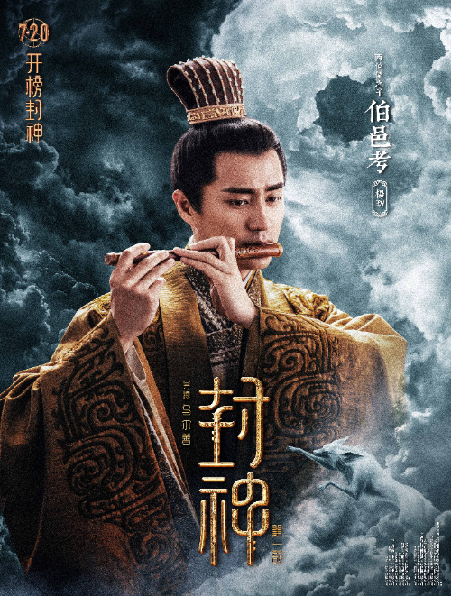
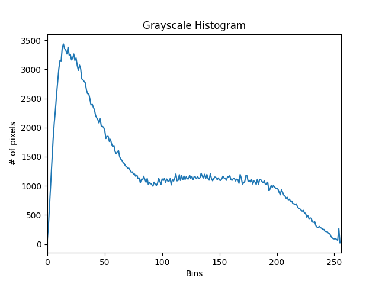
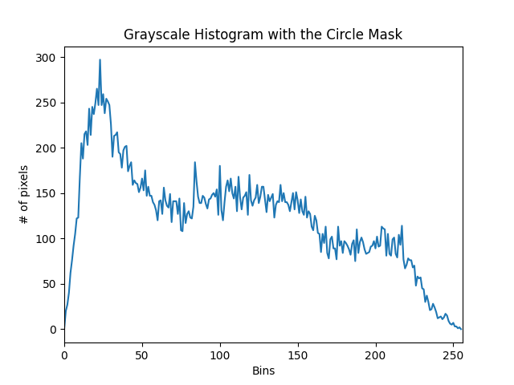
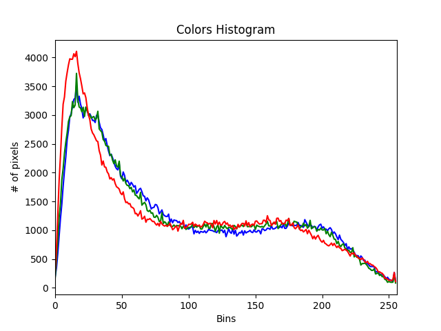
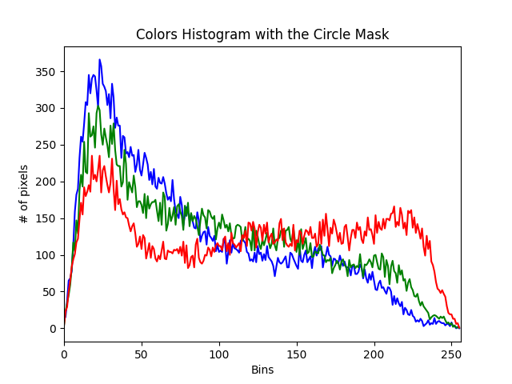

# OpenCV_Tutorial

This tutorial is developed from the
freeCodeCamp.org OpenCV Tutorial

https://youtu.be/oXlwWbU8l2o?si=53PRghV4ch3mmd2g

## What you will learn

### Basic

1. Reading Images and Video
2. Image Transformations
3. Drawing Shapes
4. Putting Text

### Advanced

1. Color Spaces
2. BITWISE operations
3. Masking
4. Histogram Computation
5. Edge Detection and Thresholding

### Faces:

1. Face Detection
2. Face Recognition
3. Deep Computer Vision (Classify the Simpsons)

## What is Computer Vision

A computer vision is an application of deep
earning that primarily focuses on deriving
insights from media files (images and videos).

## What is OpenCV

It is a computer vision library that is available
in Python, C++ and Java.

## Install the OpenCV library

### OpenCV

1. Open the terminal
2. ```pip install opencv-contrib-python```
3. This library includes the **main model** and the **contribution module** of the OpenCV library
4. The OpenCV library installation will also install the **numpy package** (for scientific computing).

### Caer

1. ```pip install caer```
2. This is the package to help speed up the workflow with a set of utility functions.

## Basics

### Reading Images & Video

import the library ```import cv2 as cv```

1. Read images
    * read the image file ```cv.imready(<file_path>)```
    * display the image ```cv.imshow(<display_window_name>,<img_file_variable>)```
    * OpenCV does not have the in-built way for ```cv.imshow()``` to deal with the image that far bigger than the
      screen. But there are other ways to mitigate the issue.

2. Read videos
    * read the video ```cv.VideoCapture([camera_idx],<file_path>)```
    * It uses a while loop to read the video frame by frame.
    * ```(-215:Assertion failed)``` This error means that the OpenCV cannot find any more frames after finish reading
      the entire video. (In general, the OpenCV cannot find the image or the video frame)

### Resize & Rescale

We resize or rescale image or video files to **prevent computation strain**. Large media files tend to store a lot of
information in it and displaying it takes up a lot of processing needs for the computer. So resizing and rescaling can
get rid of some of that information. Rescaling video implies modifying its height and width to **a particular height and
width**.

* This can resize images, videos and live
  videos ```cv.resize(<frame variable>, <dimensions[tuple]>, interpolation=cv.INTER_AREA)```.
* This can only resize live videos ```cv.set(<propid>,<scale>)```. For the ```propid```, 3 is for the width and 4 is for
  the height.

### Drawing Shapes & Putting Text

1. Paint color
2. Draw rectangles
3. Draw circles
4. Draw lines
5. Add texts

### Five Essential Functions in OpenCV

1. Grayscale the image *(you will only see the **color intensity** instead of BGR colors)*
2. Blur the image *(remove the **noise** in the image; **noise** means some elements in the image caused by the bad
   lighting or camera sensor issues)*
3. Edge cascade *(Find the **edge** in the image)*
4. Dilate and erode the image (via structuring elements)
5. Resize and crop the image

### Image Transformations

1. Translation *(shift the image along the x and y-axis)*
2. Rotation *(rotate the image by some angle)*
3. Resize
4. Flip
5. Crop

### Contour Detection

Contours are the boundary of objects. --> The line or curve that joins the continued points along the boundary of an
object. *(In mathematical scopt, contours are **NOT** same to the edges.)*

```contours, hierarchies = cv.findContours(canny, mode=cv.RETR_LIST, method=cv.CHAIN_APPROX_NONE)```

1. ```contours```--> list of all the contour coordinates that are found in the image.
2. ```hierarchies```--> hierarchical representation of contours.
3. ```mode params```:
    * ```RETR_LIST``` returns all the contours that are found in the image
    * ```RETR_EXTERNAL``` only returns the external contour of the image
    * ```RETR_TREE``` returns all the hieratical contours in the system
4. ```method params```  --> how we want to approximate the contour
    * ```CHAIN_APPROX_NONE``` --> does nothing, just return all the contours
    * ```CHAIN_APPROX_SIMPLE``` --> compress all contours into two end points only

You can visualize the image contour in the OpenCV *by exactly drawing the contour over the
image:* ```cd ./5_contour_dectection./contour3.py ```

**RECALL:** *In the OpenCV color system, the order of color is BGR (Blue-Green-Red)*

Try to distinguish the difference to the Canny. ```cd ./5_contour_dectection./contour4.py```

When looking or contours, it is recommended to use the Canny method first, and then try to find the contour by using
that, rather than using the threshold firstly. Because the simple thresholding has its disadvantages because we just
pass a single(one) value and try to binarize the image using this threshold value.

## Advanced

### Color Space

This section is going to talk about how to switch the color space via the OpenCV. **Color Space** is a space of colors,
a system of representing an array of pixel colors (e.g. RGB, Grayscale, HSV)

1. ```spaces1.py``` Convert BGR to Grayscale.
2. ```spaces2.py``` Convert BGR to HSV *(hue saturation value)*. It is based on how human see and think of the color. *(
   For more information, check https://en.wikipedia.org/wiki/HSL_and_HSV)*
3. ```spaces3.py``` Covert BGR to LAB (L\*a\*b) *(For more information,
   check https://www.mathworks.com/discovery/lab-color.html#:~:text=Lab%20color%20space%20is%20a,colors%20outside%20of%20human%20perception)*
4. OpenCV reads the image in the **BGR** color format. Outside the OpenCV, the color is not coded in the BGR. It may be
   coded as **RGB**. Check ```spaces4.py``` as an example.
5. ```spaces5.py``` OpenCV has its own way to convert the BGR image into the RGB.
6. **RECALL:** You cannot directly convert grayscale to HSV, Instead, you need to convert the grayscale firstly to BGR,
   then from BGR to HSV. ```space6.py``` shows an example of the reverse conversion to the BGR format.

### Color Channels

We are going to talk about how to split and merge color channels in OpenCV.
A color image is basically composed with three color channels: *Red, Green and Blue*.
All colors are these three colors merged together.

* By using the ```split``` method, we can split the image into the BGR color channels.
* By using the ```merge``` method, we can merge different color channels into a colorful image.

Check on ```splitmerge2.py``` how to display the original image for a specific color channel.

### Blurring Techniques

We are going to talk about the smoothing and blurring in the OpenCV.

1. **Averaging**
    * Define a kernel of window (a.k.a. 卷积核) over a specific portion of the image.
    * This windows will compute the intensity of the middle pixel (the true center) as the average of the surrounding
      pixels intensities.
    * The higher the kernel size is, the more blurring the image will be.
2. **Gaussian Blur**
    * It defines the kernel of a window similar to the **averaging** method.
    * Each pixel in the window is given with a particular weight.
      The average of the weights' product gives the value of
      the true center.
    * The Gaussian Blur tends to have less blurring compare to the **averaging** method.
    * The Gaussian Blur looks more natural than the averaging.
3. **Median Blur**
    * Instead of finding the average of surrounding pixels, it looks for the median of them.
    * It is more effective to remove noises in the image, compared with the **average and Gaussian Blur**.
    * Median Blur does not tend to set with a high kernel-size.
4. **Bilateral**
    * It is the most effective blurring and been used in a lot of advanced computer vision projects.
    * Traditional blurring method blurs the image without looking whether it reduces the edges of the image or not. But
      bilateral applies the blurring **but retains the edges in the image.**

### Bitwise Operations

There are four bitwise operators in OpenCV: **AND, OR, XOR, NOT**

Bitwise operators operate in a binary manner. A pixel is turned off if it has a *zero* value, and is turned on if it has
a value of *one*

1. Bitwise AND
    * Overlap two images with each other.
    * Return the **intersection** of two images
2. Bitwise OR
    * Overlap two images with each other.
    * Return the **intersection and non-intersection** of two images
3. Bitwise XOR
    * Overlap two images with each other.
    * Return the **non-intersection** of two images
    * *Bitwise OR - Bitwise XOR = Bitwise AND*
    * *Bitwise OR - Bitwise AND = Bitwise XOR*
4. Bitwise NOT
    * Only takes one parameter
    * Invert the pixel *(black <--> white)*

### Masking

Using bitwise operation, we can perform masking in the OpenCV.
Masking allows us to focus on certain parts of the image.
(E.g., An image with people --> we would like to focus on the faces of people --> *we can mask people's faces
and remove all the rest in the image.*)

1. ```masking1.py``` mask the image with a circle.
2. ```masking2.py``` mask the image with a rectangle.
3. ```masking3.py``` mask the image with a weird shape (by overlapping a circle and a rectangle).

*WARNING: The dimension of the mask must be the **same size** to the image.*

### Computing Histograms

We use the image ```fengshen.jpg``` as the source image.  


Histogram allows you to visualize the distribution of pixel intensities in an image (whether it is a color or grayscale
image). It will be in a graph or a plot that gives a high-level intuition of the pixel distribution in the image.

#### Grayscale

1. ```histogram_grayscale.py``` Compute the histogram for grayscale image. *(The histogram shows that there are around
   3500 pixels has the intensity of 20 to 30)*
   
2. ```histogram_grayscale2.py``` Change to another source image.
3. ```histogram_grayscale3.py``` Create a circle mask and compute the histogram for grayscale image only on the mask
   area.  
   

#### Colors

1. ```histogram_colors.py``` Compute the histogram for the color
   image.  
   

2. ```histogram_colors2.py``` Create a circle mask and compute the histogram for the color image only on the mask
   area.  
   

### Thresholding

Thresholding is to binarize of the image. We want to take an image and convert it to a binary image. It is an image
where pixels are either zero *(black)* or 255 *(white)*.
An elementary example of thresholding would be to take an image and take some particular value *(thresholding value)*,
and compare each pixel of the image to this threshold of value.

* If the pixel intensity is less than the threshold value, we set that pixel intensity to zero.
* If the pixel intensity is above the threshold value, we set that pixel intensity to 255.

#### Simple Thresholding

```simple_thresholding.py``` Manually set a threshold value.

* Set the pixel intensity to zero if the initial pixel intensity is equal or below the
  threshold value.
* Set the pixel intensity to maxVal if the initial pixel intensity is above threshold value.

#### Adaptive Thresholding

```adaptive_thresholding.py``` Let the computer decide the thresholding value by itself, instead of manually setting the
threshold value. Then use the threshold value it finds to binarize the image.

### Edge Detection

We are going to talk about the **gradient** and **edge detections** in the OpenCV.

#### Laplacian Method

* ```laplacian.py```

#### Sobel Method

* ```sobel.py```
* Sobel computes the gradient in the x and y directions

*RECALL: **Canny** is a multi-stage process. One of the stages is to use the Sobel method to compute the gradient.*

## Faces

### Face Detection